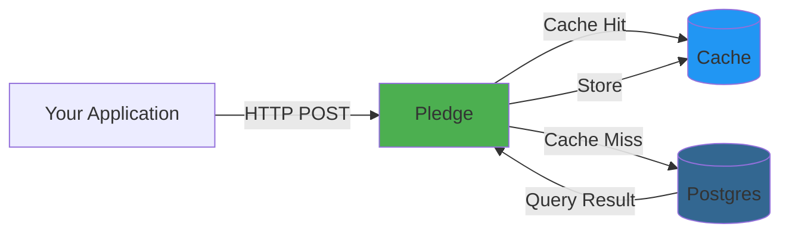

# Pledge 

[](https://opensource.org/licenses/Apache-2.0)

## **THIS IS A WORK IN PROGRESS, AND NOT READY FOR PRODUCTION USE**

Make your Postgres queries 100x faster

Pledge is a **free and open-source** caching layer for Postgres that aims to improve query performance by caching frequently used queries. 
The queries that should be cached are defined in the `pledge.toml` file. With the support for dynamic queries with placeholders, Pledge can cache queries with different parameters, or just queries with predefined parameters.

Pledge is also meant to be used as a pass-through layer for Postgres, allowing you to use it as a caching layer for your Postgres database.

## Architecture



## How It Works

Send all SQL queries to Pledge via HTTP:

```bash
# Reads (cached):
POST /query {"sql": "SELECT ...", "params": [...]}

# Writes (executed, cache not invalidated):
POST /query {"sql": "UPDATE ...", "params": [...]}
```
Cache Invalidation:
- Currently: Time-based (TTL)
- Each query can have custom TTL
- Writes do not auto-invalidate cache
- Future: Automatic invalidation (v0.?+)

When to Use:
- ✅ Data that changes infrequently (products, configs)
- ✅ Acceptable eventual consistency (dashboards, analytics)
- ⚠️ Not recommended: Financial balances, inventory counts (use short TTL if needed)

## Config

```toml
# pledge.toml
[database]
url = "postgres://..."

[cache]
global_ttl = 300

[server]
port = 3000

[[queries]]
name = "get_user"
sql = "SELECT id, name FROM users WHERE id = $1"
ttl = 300

[[queries]]
name = "search_users_by_content"
sql = "SELECT u.email, COUNT(*) as match_count, MAX(p.created_at) as latest_match FROM users u JOIN posts p ON u.id = p.user_id WHERE p.content ILIKE $1 OR p.content ILIKE $2 OR p.title ILIKE $3 GROUP BY u.email ORDER BY match_count DESC LIMIT 20"

```

## Features/Roadmap

### Implemented
- Per-query TTL cache invalidation (with global TTL fallback).
- LFU-based eviction when cache is full.
- Prometheus-format metrics.
- Support for PostgreSQL.
- HTTPS/TLS support.
- Configurable cache size limits.
- Parameterized query support.
- System usage warning (warns if cache exceeds 80% of available memory).

### Planned
- PostgreSQL Wire Protocol Support.
- Support for MySQL.
- Docker image.
- Query preloading/warmup.
- Automatic cache invalidation on writes.

If you have feature requests, please open an issue on GitHub, but please be aware this is still early in development.

## License

  Pledge is licensed under the Apache License 2.0. See [LICENSE](LICENSE) for the full license text.

  Copyright 2026 Magnus Stuart Juul
